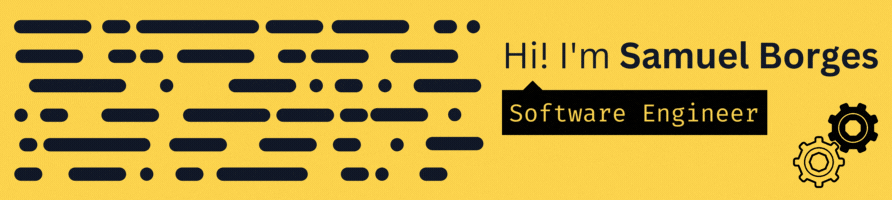

As a recent graduate of the University of Brasília (UnB) with a Bachelor's degree in Software Engineering, I am eager and excited to embark on new and challenging opportunities. I like solving problems and learning new skills.

- I like building useful things
- I'm fascinated by UI/UX
- I'm interested in DevOps
- I'm curious about AI/ML
- I ❤️ FOSS

### Languages 🌐

### Frontend 🖥️

### Backend 💽

### Databases 💾

### DevOps 🔧

### GitHub Analytics 📊

 

 
 

### Follow me on 👍

